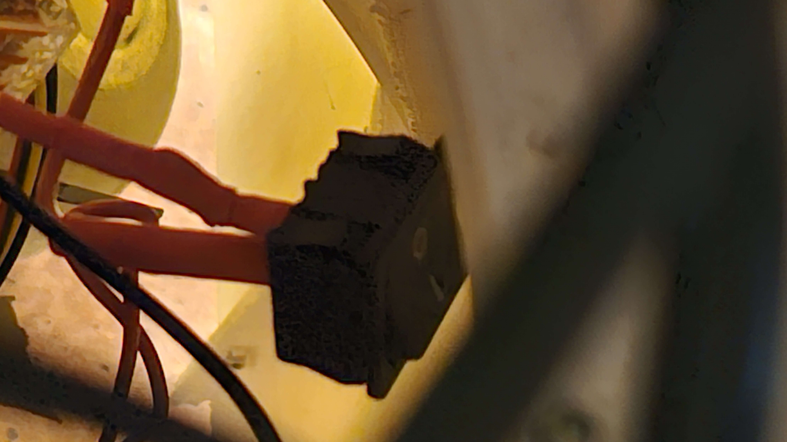

# Roboti kasutamine messidel


## Liikuma panemine

* Selleks, et robot liikuma hakkaks, tuleb roboti sees omavahel ühendada ** BAT 24V **


* Siis on tõenäosus olemas, et tuled lähevad sees põlema. Kui ei lähe, siis tuleb vajutada musta lülitit. Praegusel hetkel ta ripub roboti sees.



* Selle tulemusena peaksid tuled põlema minema.
* Siis tuleb ~30 sek oodata, panna pult tööle ja robot peaks liikuma hakkama, kui hoida LB nuppu all
* Kui robot ei liigu, siis tuleb roboti sees olev punane nupp lahti lasta ja selle tulemusena peaks ~ 5 sekundi pärast liikuma hakkama.

## Messi ettevalmistus

* Kõigepealt on mõistlik ühendada Semuboti ruuter vooluvõrku.
* Seejärel ühendada arvuti juhe arvuti endaga ja vooluvõrguga. Juhtme saab vedada läbi roboti, niimoodi et juhe tuleks roboti alt.
* Arvuti peaks seejärel ise automaatselt tööle minema. Kui ei lähe, siis tuleb manuaalselt käima panna. Startnupp on arvutil roboti rinna pool, üleval.
* Harvadel juhtudel ei tule automaatselt nägu robotile ette. Sel juhul on kõige lihtsam korra voolujuhe tagant ära võtta ja tagasi panna.


## Rääkima panemine

* Veendu et arvuti oleks Semuboti wifis. 
* Seejärel järgi kas Ubuntu või Windowsi juhendit


### Ubuntu

* Ava terminal, lühend on: "ctrl + alt + t"
* Loo ssh ühendus, kui kasutusel on Semuboti läpakad, saab kasutada käsku:

                
```
ssh nuc

```
Seejärel võiks avaneda järgnev vaatepilt:


* Kui käsk ei tööta, võib kasutada ka järgnevat:

```
ssh semubot@192.168.0.90

```

* Juhul kui pärast käsu jooksutamist küsib parooli, siis parool on **semubot**
* Nüüd peaks samuti olema samasugune vaatepilt.


#### Helitugevuse muutmine

* Heli saab muuta käsuga

```
volume 50

```


* See käsk paneb hääle tugevuseks 50. Valida saab vahemikus 0-100.


#### Rääkima panemine

* Rääkima saab panna kolme viisi.
* Esimene käsuga 

```
sayhi

```
* Antud käsk paneb roboti rääkima pika teksti.
* Enda teksti saab rääkima panna käsuga

```
speak "Tere! Mina olen Semubot"

```
* Kus siis jutumärkide vahele saab panna oma teksti


* Seejärel ta natukene mõtleb ja lõpuks räägib

* Sama käsuga saab rääkima panna ka eelmist "speak" käsu tulemust
* Seda saab käsuga:

```
speak -a
```


